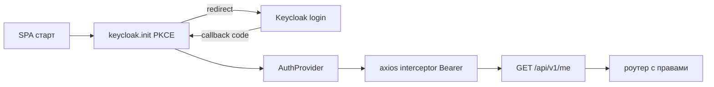

# План: фронтенд Watch (React + TypeScript)

Полноценный клиент backend-сервиса учёта занятости. Русскоязычный,
минималистичный, Ant Design v5, без inline-стилей (theme-токены + flex/grid).

## Стек

- Vite 6 + React 18 + TypeScript (strict)
- react-router-dom (lazy-loading страниц, защищённые маршруты)
- Ant Design v5 + @ant-design/icons + dayjs (русская локаль)
- keycloak-js — OIDC **Authorization Code + PKCE** (S256)
- axios — типизированный API-клиент, перехватчик Bearer-токена и 401-обработка
- @tanstack/react-query v5 — данные, мутации, инвалидация кэша
- socket.io-client — live-обновления (Redis pub/sub за бэкендом)
- Типы DTO — по OpenAPI бэкенда (src/api/types.ts)

## Аутентификация (Keycloak)

1. `keycloak.init({ onLoad: "login-required", pkceMethod: "S256", redirectUri })`
2. `AuthProvider`: состояние `loading / authenticated / unauthenticated`;
   после входа — профиль (имя, email) и список групп из токена
3. axios-перехватчик запросов: `Authorization: Bearer <access_token>`;
   перед запросом `keycloak.updateToken(30)` (автообновление);
   при 401 — попытка обновить токен и повторить запрос, иначе logout
4. `RequireAuth` — защищённый маршрут: пока грузится Keycloak — спиннер,
   не аутентифицирован — редирект на логин



## Ролевая модель (права)

Маппинг групп Keycloak → действия (все аутентифицированные получают чтение):

| Группа | Действия |
|---|---|
| personnel-managers | employees:manage |
| project-managers | projects:manage |
| occupancy-managers | occupancy:manage |
| admin | все три + аудит |

Хук `usePermission().can(action)` скрывает кнопки, пункты меню и маршруты.
Компонент-обёртка `PermissionGate`.

**Правка бэкенда** (обязательна, иначе admin получит 403):
[`src/services/permissions.py`](src/services/permissions.py) — добавить
`"admin"` во все группы управления. Также в
[`scripts/provision_keycloak.py`](scripts/provision_keycloak.py) — создать
клиент `watch-frontend` (public, redirect `http://localhost:5173/*`) и группу
`admin`.

## Страницы и маршруты

| Маршрут | Страница | Виден | CRUD |
|---|---|---|---|
| /employees | Сотрудники (таблица + модалки; суб-записи вкладками) | всем | personnel, admin |
| /projects | Проекты (таблица, месторождения expandable, назначения drawer) | всем | project, admin |
| /occupancy | Занятость (окно просмотра RangePicker, периоды 8 видов, финансы+файлы) | всем | occupancy, admin |
| /audit | Аудит-лог (таблица old/new) | admin | чтение |
| * | 404 | — | — |

`/` → редирект на `/occupancy`. Каждая страница — `React.lazy` + Suspense.

## Компоненты и UX

- **AppLayout**: Sider-меню (по правам), Header (имя пользователя, logout),
  содержимое; тема через `ConfigProvider theme.token` (без inline-стилей)
- **Таблицы**: сортировка колонок, поиск/фильтры, пагинация (клиентская)
- **Формы**: Ant Design Form, валидация правил, DatePicker/RangePicker (dayjs)
- **Удаление**: `Modal.confirm` / Popconfirm + message об успехе
- **Состояния**: спиннеры (Skeleton/Spin), `Result` для ошибок,
  `Empty` для пустых списков
- **Периоды занятости**: динамическая форма деталей по типу через реестр
  рендереров (shift → месторождение+примечания, flight → рейс/аэропорты и т.д.)
- **Финансы**: Drawer периода — список доходов/расходов, формы, загрузка
  файлов (Upload) и скачивание

## Live-обновления (Socket.IO)

- Подключение с токеном в `auth`; события `view:init` → `view:snapshot`,
  далее `data:changed`
- Окно просмотра берётся со страницы «Занятость» (по умолчанию текущий месяц)
- При `data:changed` — обновление соответствующих query-кэшей
  (employee/project/period/financial) без перезагрузки страницы
- Обработка reconnect и ошибок соединения (message-уведомление)

## Структура

```
frontend/
├── package.json  vite.config.ts  tsconfig.json  index.html  .env.example
└── src/
    ├── main.tsx  App.tsx  config.ts
    ├── auth/      keycloak.ts  AuthProvider.tsx  useAuth.ts  RequireAuth.tsx
    ├── permissions.ts
    ├── api/       client.ts  types.ts  endpoints.ts
    ├── hooks/     queries.ts (react-query)
    ├── realtime/  socket.ts  useRealtime.ts
    ├── components/ layout/AppLayout.tsx  PermissionGate.tsx
    │              ConfirmDeleteButton.tsx  States.tsx  PageHeader.tsx
    ├── pages/
    │   ├── employees/  EmployeesPage.tsx  EmployeeFormModal.tsx  EmployeeSubRecords.tsx
    │   ├── projects/   ProjectsPage.tsx  ProjectFormModal.tsx  FieldsBlock.tsx  AssignmentDrawer.tsx
    │   ├── occupancy/  OccupancyPage.tsx  PeriodFormModal.tsx  detail-renderers/  FinanceDrawer.tsx
    │   ├── audit/      AuditPage.tsx
    │   └── NotFound.tsx
    └── theme.ts
```

## Конфигурация (env)

`VITE_API_URL` (по умолчанию http://localhost:8000), `VITE_KEYCLOAK_URL`,
`VITE_KEYCLOAK_REALM`, `VITE_KEYCLOAK_CLIENT_ID`. Vite dev-сервер на :5173
(порт учтён в CORS бэкенда).

## Сборка

- `npm run dev` — Vite dev-server с HMR
- `npm run build` — `tsc -b && vite build` (статическая сборка в dist/)
- Пример nginx для SPA (try_files → index.html) — в README фронтенда

## Порядок реализации

1. Каркас Vite + конфигурация + env
2. Keycloak auth (PKCE) + axios-перехватчик + RequireAuth
3. Права: permissions.ts, usePermission, PermissionGate
4. API-клиент: types.ts (DTO по OpenAPI), endpoints.ts
5. React Query хуки + состояния загрузки/ошибок/пустоты
6. Layout + тема + роутинг с lazy-loading
7. Страница сотрудников (+суб-записи)
8. Страница проектов (месторождения, назначения)
9. Страница занятости (окно просмотра, периоды, динамические детали видов)
10. Финансы и файлы в Drawer периода
11. Страница аудит-лога
12. Socket.IO live-обновления
13. Правки бэкенда: admin в разрешения, watch-frontend в провижининг
14. README фронтенда + пример nginx