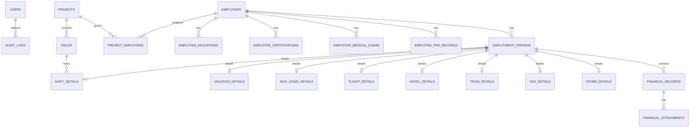
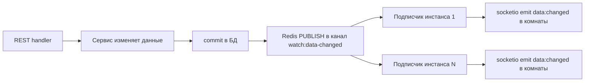

# План: сервис учёта занятости работников

## Стек

- Python 3.12, FastAPI, uvicorn
- SQLAlchemy 2.0 (async) + asyncpg + Alembic
- python-socketio (ASGI-режим, совмещён с FastAPI)
- Keycloak: валидация JWT (RS256) через JWKS, группы в токене
- Redis: pub/sub шина доменных событий — изменения данных публикуются в канал и доставляются всем инстансам приложения, каждый инстанс рассылает события своим подключённым слушателям
- S3-совместимое хранилище для файлов-подтверждений (boto3/aiobotocore; MinIO в docker-compose)
- aiosmtplib / fastapi-mail для email-уведомлений
- nginx как reverse proxy (включая WebSocket upgrade для /socket.io)
- docker-compose: postgres + keycloak + redis + minio для локальной разработки

## Принятые допущения (по умолчанию, если не оговорено иное)

1. **Права**: группы Keycloak, которые передаются в токене (claim groups), маппятся в наборы разрешений:
   - `personnel-managers` → сотрудники: полный CRUD
   - `project-managers` → проекты/месторождения: полный CRUD + назначение сотрудников на проекты
   - `occupancy-managers` → периоды занятости и финансы: полный CRUD
   - Все аутентифицированные пользователи → чтение
   - **ABAC-lite**: опциональный claim `projects` в токене ограничивает область видимости данными конкретных проектов; если claim отсутствует — видна вся база. Полноценный движок политик (OPA и т.п.) в boilerplate не включаем.
2. **Семантика просмотра**: клиент передаёт `from` и `to` (опционально, по умолчанию — весь текущий месяц). Возвращаются периоды, пересекающиеся с интервалом `[from, to]` (включая начатые ранее, но незавершённые, начатые в период и завершающиеся после выбранного периода, начатые ранее интервала и оканчивающиеся после периода, то есть продолжающиеся во время указаное в интервале). Live-обновления по Socket.IO доставляются для тех же фильтров.
3. **DELETE** — мягкое удаление: проставляется `active=false` и `update_reason=deleted`, запись сохраняется, действие пишется в аудит с автором.
4. **Связи видов занятости**: у периода есть обязательный `тип периода` (например, гостиница/перелёт привязаны к вахте). Пересечения по времени допустимы.
5. **Финансы**: на один период может быть несколько записей доходов/расходов; у каждой записи — произвольное число файлов-подтверждений. Файлы хранятся в s3, в БД — только метаданные.
5.1 **Примечания**: у каждого вида занятости могут быть различные поля.
6. **Уведомления**: при создании/изменении/мягком удалении периода занятости и при добавлении финансовых записей на email работника уходит письмо (SMTP, шаблоны в текстовом виде).
7. **Аудит**: любые изменения (insert/update/delete) любой таблицы через SQLAlchemy event listeners; автор берётся из contextvar, который заполняется auth-dependency.
8. Существующие файлы `src/entities/people/*` (черновик с синтаксическими ошибками) заменяются новой структурой `src/models/*`.
9. **Масштабирование**: приложение может запускаться несколькими инстансами за nginx. Доставка live-обновлений — только через Redis pub/sub, чтобы события с одного инстанса достигали слушателей на всех остальных.

## Модель данных

### Сущности

- **users** — системные пользователи (управленцы), синхронизируются из Keycloak при каждом запросе (последний вход, имя, email)
- **employees** — работники (доступа в комплекс не имеют), мастер-данные: email, телефон, ФИО, записи об образовании, записи о сертификации (может иметь срок давности), медосмотрам (имеет срок давности), выдаче средств индивидуальной защиты и одежды (имеет срок давности)
  - `employee_educations` — образование: название, учреждение, год окончания
  - `employee_certifications` — сертификаты: название, дата выдачи, `expires_at` (срок давности)
  - `employee_medical_exams` — медосмотры: дата, `expires_at` (срок давности), заключение
  - `employee_ppe_records` — выдача СИЗ/спецодежды: наименование, дата выдачи, `expires_at` (срок давности)
- **projects** — проекты
- **fields** — месторождения (принадлежат проекту)
- **project_employees** — назначение работника на проект (кто назначил, когда)
- **employment_periods** — ЕДИНАЯ таблица периодов занятости:
  - id (UUID), employee_id, period_type (enum: shift/vacation/sick_leave/flight/hotel/train/taxi/other)
  - created_at, started_at, ended_at
  - updated_at, updated_by, update_reason (создан, удален, обновлен, отменен и др. в зависимости от period_type), version (int), active (bool)
  - discriminator type + FK 1:1 на таблицу деталей конкретного модуля
- **Таблицы деталей модулей** (по одной на вид): `shift_details`, `vacation_details`, `sick_leave_details`, `flight_details`, `hotel_details`, `train_details`, `taxi_details`, `other_details` — хранят специфичные для вида поля:
  - shift: `field_id` (месторождение, где ведётся вахта), примечания
  - vacation / sick_leave / other: примечания
  - flight: авиакомпания, номер рейса, аэропорты и время вылета/прилёта
  - hotel: название, город, адрес, заезд/выезд
  - train: маршрут, номер поезда, вагон, место
  - taxi: откуда, куда, время
- **financial_records** — доход/расход периода: kind (income/expense), amount (float), description (text), period_id
- **financial_attachments** — файлы подтверждений: record_id, имя файла, mime, размер, ключ объекта в S3, загрузивший
- **audit_logs** — entity_type, entity_id, action, old_values (jsonb), new_values (jsonb), actor_id, created_at

### Схема связей



### Унифицированный интерфейс модуля занятости

```python
class OccupancyModule(Protocol):
    type_name: str            # "shift", "vacation", ...
    label: str                # человекочитаемое имя
    detail_model: type[Base]  # SQLAlchemy-модель таблицы деталей
    create_schema: type[BaseModel]
    update_schema: type[BaseModel]
    def validate(self, payload, period) -> None: ...
    def to_view(self, period, detail) -> dict: ...
```

Реестр `OCCUPANCY_REGISTRY: dict[str, OccupancyModule]` заполняется декоратором `@register_occupancy_type`. Эндпоинты деталей CRUD — единые, параметризуются `period_type`. Добавление нового вида = новый файл-модуль + регистрация (поля вида определяются внутри модуля, см. 5.1).

## REST API (префикс /api/v1)

| Метод | Путь | Права |
|---|---|---|
| POST/GET | /employees; GET/PUT/DELETE /employees/{id} | персонал (CRUD), чтение всем |
| POST/GET | /employees/{id}/educations, /certifications, /medical-exams, /ppe-records; PUT/DELETE по id записи | персонал (CRUD) |
| POST/GET | /projects; GET/PUT/DELETE /projects/{id} | проектный менеджер |
| POST/GET | /projects/{id}/fields; PUT/DELETE /fields/{id} | проектный менеджер |
| GET/POST | /projects/{id}/employees (назначить/снять работника) | проектный менеджер |
| POST/GET | /employment-periods; GET/PUT/DELETE /employment-periods/{id} | группа занятости |
| GET/PUT/DELETE | /employment-periods/{id}/{period_type} (детали модуля) | группа занятости |
| GET/POST | /employment-periods/{id}/financial-records; PUT/DELETE /financial-records/{id} | группа занятости |
| POST | /financial-records/{id}/attachments (multipart) | группа занятости |
| GET | /attachments/{id} (скачивание потоком из S3) | чтение |
| GET | /view/init?from=&to= (snapshot интервала, по умолчанию текущий месяц) | чтение |
| GET | /audit-logs?entity=&entity_id= | чтение |
| GET | /me | любой аутентифицированный |

Особенности периодов занятости:
- POST — создание: `update_reason=создан`, `version=1`, `active=true`
- PUT — обновление: инкремент `version`, обязательный `update_reason` (обновлен/отменен и др.), `updated_by`
- DELETE — мягкое удаление: `active=false`, `update_reason=удален`

Каждый запрос проходит через dependency: валидация JWT (JWKS, issuer, audience, exp) → upsert пользователя в `users` → установка contextvar автора → проверка разрешения.

## Socket.IO протокол и Redis pub/sub

- Подключение: клиент передаёт токен в `auth` (проверяется на `connect`)
- `view:init` `{from, to?, project_ids?}` — сервер подписывает клиента в комнату пользователя с фильтром, возвращает тот же snapshot, что и REST `/view/init`
- При любом изменении данных сервер шлёт комнате событие `data:changed`: `{entity, action, payload}` — клиент обновляет экран без перезагрузки
- `view:close` — отписка

### Доставка изменений всем слушателям через Redis pub/sub

1. REST/сервисные операции после успешного commit публикуют доменное событие в Redis-канал `watch:data-changed`: `{entity, action, payload, period_id, project_ids}`
2. Каждый инстанс приложения держит фоновую подписку на канал (redis.asyncio pubsub)
3. Подписчик сопоставляет событие с активными подписками слушателей (комнаты пользователей и их фильтры from/to/projects) и шлёт `data:changed` только тем комнатам, чьи фильтры пересекаются с затронутыми данными
4. Горизонтальное масштабирование: любое число инстансов uvicorn/gunicorn — каждое событие доходит до всех слушателей независимо от того, на каком инстансе произошло изменение



## Аудит

- `audit_logs` пишется автоматически event-listener'ами SQLAlchemy (after_insert / after_update / after_delete) для всех моделей
- old/new значения сериализуются в JSONB
- автор — из contextvar, устанавливаемого auth-dependency; фоновые операции (email и т.п.) пишут system

## Уведомления

- Сервис `notifications.py`: очередь через BackgroundTasks FastAPI, отправка aiosmtplib
- Триггеры: создание/изменение/удаление периода, добавление финансовой записи
- Получатель — email работника из `employees.email`
- Шаблоны писем — текстовые (в коде), отдельный шаблон на сценарий

## Хранение файлов (S3)

- Сервис `storage.py`: aiobotocore-клиент (S3-совместимый, MinIO локально)
- Загрузка: multipart → PUT объект в бакет → метаданные в `financial_attachments` (ключ, имя, mime, размер, автор)
- Скачивание: GET объект из S3 и потоковая отдача
- Конфигурация из env: S3_ENDPOINT, S3_ACCESS_KEY, S3_SECRET_KEY, S3_BUCKET, S3_REGION

## Деплой

- `nginx/nginx.conf`: proxy_pass на приложение, `Upgrade`/`Connection` заголовки для `/socket.io/`, лимиты на загрузку файлов
- `docker-compose.yml`: postgres:16 (volume, healthcheck), keycloak:26 (realm-import), redis:7 (appendonly), minio (S3), приложение (профиль)
- `.env.example`: DATABASE_URL, REDIS_URL, KEYCLOAK_SERVER_URL/REALM/CLIENT_ID/CLIENT_SECRET/JWKS_URL, SMTP_*, S3_*, CORS_ORIGINS
- README: инструкция по созданию realm, клиента, групп и маппера групп в токен

## Структура проекта

```
watch/
├── .env.example
├── docker-compose.yml
├── nginx/nginx.conf
├── alembic.ini
├── alembic/env.py, versions/
├── requirements.txt
├── README.md
├── plans/plan.md
└── src/
    ├── main.py                  # FastAPI + Socket.IO + запуск подписки EventBus
    ├── config.py                # pydantic-settings (env)
    ├── database.py              # async engine/session
    ├── models/                  # SQLAlchemy
    │   ├── base.py              # Base, UUIDMixin, TimestampMixin
    │   ├── user.py employee.py project.py employment_period.py
    │   ├── financial.py audit.py
    │   └── occupancy/           # base.py + модули видов
    ├── schemas/                 # Pydantic
    ├── api/                     # deps.py, router.py, endpoints/
    ├── services/                # auth.py permissions.py audit.py
    │   └── notifications.py storage.py occupancy_registry.py view_service.py
    └── sockets/                 # manager.py events.py events_bus.py
```

## Порядок реализации

1. Каркас (config, database, зависимости)
2. Модели БД (базовые + сотрудник с суб-записями + период + модули видов + финансы + аудит)
3. Alembic миграция
4. Keycloak-аутентификация + права
5. REST-эндпоинты
6. Redis pub/sub шина событий (EventBus: публикация из сервисов, подписка и пересылка в Socket.IO)
7. Socket.IO live-обновления (view:init, data:changed через EventBus)
8. Email-уведомления и S3-хранилище файлов
9. nginx + docker-compose + README
